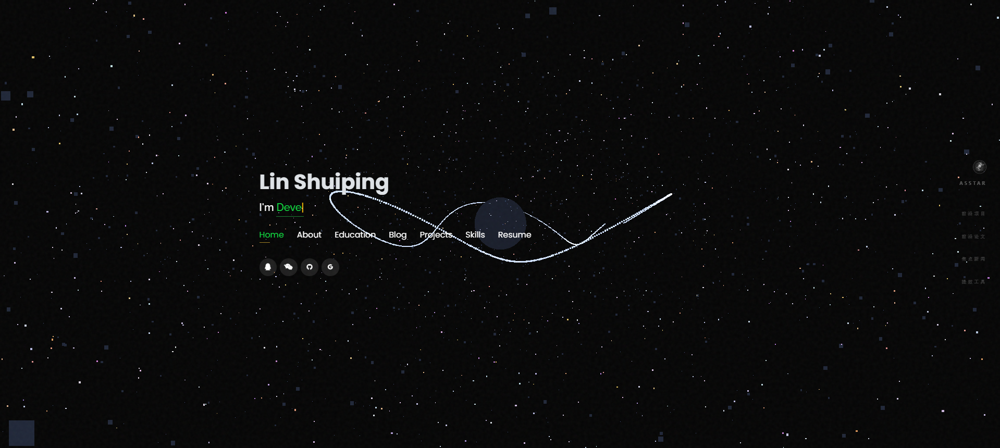
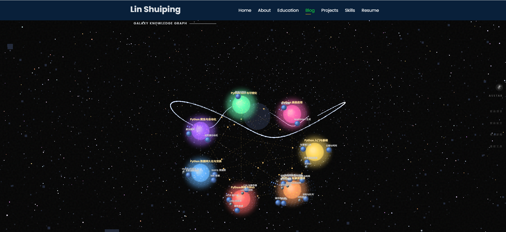

# StarSky 个人星空风格网站
> 一个具有沉浸式宇宙背景、流星鼠标轨迹和动态知识图谱的交互式个人作品集网站。  
> 展示个人的教育背景、项目经历、技术栈与成就。

## 📸 网站预览

 <!-- 替换为你的网站截图链接 -->
 <!-- 替换为你的网站截图链接 -->

> **立即体验**: 访问 [在线演示版本](http://shuiping.vxni.ink/)  <!-- 替换为你的网站链接 -->

---

## ✨ 功能特性

- **动态宇宙背景** – 使用 Three.js 生成 3D 星空、星云、光环和动态视差效果。
- **流星鼠标轨迹** – 鼠标移动时产生带有光晕的拖尾粒子效果，增强科技感。
- **星系知识图谱** – 基于 Canvas 绘制的互动星系图谱（`Blog` 板块），展示知识连接。
- **个人简介** – 包含个人照片、联系方式、教育背景、兴趣领域。
- **成就墙** – 网格展示获奖证书和荣誉称号，支持点击全屏预览。
- **项目展示** – 展示毕业设计（图神经网络+知识图谱嵌入）和图像识别服务等项目。
- **技能标签** – 以矢量 logo 形式展示技能。
- **Trending Project**: 实时展示GitHub、Huggingface社区最热门的开源项目，支持每日、每周、每月趋势查看。✨
- **Trending Papers**: 实时展示AI社区最热门的论文，支持Trending、Most Likes、Most Downloads分类 ✨
- **沉浸式体验**: 动态的界面设计和流畅的交互，带来无缝的浏览体验。
- **AI对话**: 基于通义千问的智能聊天助手，提供问题解答和创作建议。
- **响应式设计**: 完美适配桌面和移动设备，随时随地探索。
- **工具盒子**: 基于自研和精选工具，来进一步工作提效。💕
---

## 🛠️ 技术栈

| 类别           | 技术 |
|---------------|------|
| 前端基础       | HTML5, CSS3, JavaScript (ES6) |
| 3D 图形库      | Three.js (r128) |
| UI 框架 & 组件 | Bootstrap 4, Font Awesome 5, Boxicons, Remixicon, Owl Carousel, Venobox |
| 交互动效       | Typed.js (打字效果), jQuery, Isotope (项目过滤) |
| 知识图谱绘制   | 原生 Canvas API |
| 工具 & 部署    | Git, GitHub Pages / 任何静态服务器 |

---

## 📁 目录结构

```
.
├── index.html                 # 主页面（完整作品集）
├── assets/
│   ├── css/                   # 自定义样式 (style_main.css)
│   ├── img/                   # 所有图片资源
│   │   ├── me.jpg   		   # 个人圆形头像
│   │   ├── Asstar.jpg         # 导航栏 Logo
│   │   ├── education/         # 学校徽章
│   │   ├── certification/     # 获奖证书图片
│   │   └── project/           # 项目缩略图
│   └── vendor/                # 第三方库本地备份 (jQuery, Bootstrap, 等)
├── projects/                  # Bolg详情页（iframe 内容）
│   ├── list.json
│   └── python.md
└── README.md                  # 本文件
```

> **注意**：所有外部依赖均通过 CDN 加载，但 `assets/vendor` 目录依然包含了部分本地回退文件。

---

## 🚀 如何运行 / 部署

### 本地运行
1. 克隆仓库到本地：
   ```bash
   git clone https://github.com/Linlevel/your-repo-name.git
   cd your-repo-name
   ```
2. 使用任意静态服务器（推荐使用 `live-server` 或 Python 内置 HTTP 服务器）：
   ```bash
   # Python 3
   python -m http.server 8000
   # 或使用 npx live-server
   npx live-server
   ```
3. 打开浏览器访问 `http://localhost:8000`。

### 部署到 GitHub Pages
1. 将仓库推送到 GitHub。
2. 进入仓库 `Settings` → `Pages`。
3. 在 “Branch” 中选择 `main` 分支，根目录 `/` 保存。
4. 几分钟后即可通过 `https://你的用户名.github.io/仓库名/` 访问。

---

## 🧩 主要板块说明

| 板块 ID | 内容描述 |
|---------|----------|
| `#header` | 个人标题、动态职业标签（Coder / Developer / AI Enthusiast）及社交链接 |
| `#about`  | 个人简介、兴趣方向（AI开发、算法、NLP、CV等） |
| `#education` | 教育经历及期间获奖证书（可点击全屏预览） |
| `#Blog` | 星系知识图谱 —— 一个Canvas动画展示知识点之间的连接关系 |
| `#portfolio` | 个人项目卡片 |
| `#skills`   | 技术技能图标墙：语言、框架、数据库、云平台 |

---

## 📝 自定义指南

- **修改个人信息**：编辑 HTML 中对应的文本（姓名、生日、电话、邮箱等）。
- **更换头像**：替换 `assets/img/chengtailang.jpg` 并保持图片比例1:1。
- **更新项目**：在 `#portfolio` 的 `.portfolio-container` 中添加新的项目卡片，并创建对应的 `projects/xxx.html` 详情页。
- **调整星空效果**：修改 Three.js 参数（星星数量、颜色、雾浓度等）。

---
## 📄 许可

本项目基于 [MIT 许可证](LICENSE) 开源。你可以自由使用、修改和分发，但请保留原始版权声明。

---

## 🙏 致谢

- 字体与图标：Google Fonts, FontAwesome, Boxicons, Remixicon。
- 3D 灵感：Three.js 社区。
- 模版初始结构参考了 BootstrapMade 的 “Personal” 主题，并进行了深度宇宙风格改造。

---

## 📧 联系作者

林水平 (Lin Shuiping)  
- 邮箱：[linsplevel@gmail.com](mailto:linsplevel@gmail.com)  
- QQ：1934135105  
- GitHub：[Linlevel](https://github.com/Linlevel)  

---

🎉 **如果这个项目对你有帮助，欢迎 Star ⭐ 和 Fork！**
